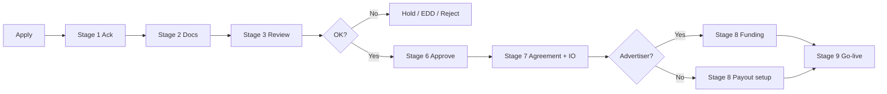

# Small-team operating system (5 people)

**Purpose:** Run ConvertLane without duplicate work, missed gates, or “who owns this?” — built for a startup, not an enterprise.

**Use with:** [16-control-gates.md](16-control-gates.md) · [17-ops-calendar.md](17-ops-calendar.md) · [workflows/](workflows/00-index.md)

---

## 1. Non-negotiable rules (fail-proof)

1. **No tracking links** until `/compliance` = `approved` + signed IO.  
2. **No advertiser caps** until Finance records prepay or credit (Gate 5).  
3. **No publisher payout** if Compliance flagged the partner or advertiser funds don’t cover liability.  
4. **Every status change** gets an audit note in `/compliance`.  
5. **Client emails** only from [onboarding/*/client/](../due-diligence/onboarding/README.md) templates.  
6. **Internal checklists** filed per stage in `DD-{id}/` (Drive folder mirror).

---

## 2. Weekly rhythm (whole team — 30 min stand-up)

| Day | Focus | Who speaks |
|-----|--------|------------|
| Mon | New applications + stuck DD | Compliance |
| Mon | Offers going live this week | Advertiser + Publisher leads |
| Wed | Fraud / invalid rate by offer | Compliance + Finance |
| Fri | Cash: prepay balances + payout run prep | Finance |
| Fri | Pipeline: apply → approved conversion | MD (5 min) |

**Shared doc:** one spreadsheet — “This week” tab: apps in flight, offers live, overdue invoices, payout date.

---

## 3. Partner onboarding — single path

**Index:** [onboarding/README.md](../due-diligence/onboarding/README.md)

---

## 4. Role workflows (detail)

| Role | Daily workflow | Playbook |
|------|----------------|----------|
| MD | [workflows/md.md](workflows/md.md) | [roles/md.md](roles/md.md) |
| Compliance | [workflows/compliance.md](workflows/compliance.md) | [roles/compliance.md](roles/compliance.md) |
| Publisher Lead | [workflows/publisher-lead.md](workflows/publisher-lead.md) | [roles/publisher-lead.md](roles/publisher-lead.md) |
| Advertiser Lead | [workflows/advertiser-lead.md](workflows/advertiser-lead.md) | [roles/advertiser-lead.md](roles/advertiser-lead.md) |
| Finance & Ops | [workflows/finance-ops.md](workflows/finance-ops.md) | [roles/finance-ops.md](roles/finance-ops.md) |

---

## 5. Documentation map (everything covered)

| Area | Document | Owner |
|------|----------|-------|
| **What’s missing before launch** | [15-readiness-checklist.md](15-readiness-checklist.md) | MD |
| **Gates (no bypass)** | [16-control-gates.md](16-control-gates.md) | Compliance |
| **Calendar** | [17-ops-calendar.md](17-ops-calendar.md) | Finance |
| **Team RACI** | [01-team-and-responsibilities.md](01-team-and-responsibilities.md) | MD |
| **Lifecycle** | [02-partner-lifecycle.md](02-partner-lifecycle.md) | Compliance |
| **KYC/KYB policy** | [03-kyc-kyb-policy.md](03-kyc-kyb-policy.md) | Compliance |
| **Fraud** | [04-compliance-fraud-policy.md](04-compliance-fraud-policy.md) | Compliance |
| **Agreements** | [05](05-publisher-agreement.md), [06](06-advertiser-agreement.md) | MD + solicitor |
| **IO** | [07-insertion-order-template.md](07-insertion-order-template.md) | AMs |
| **Publisher payouts** | [08-publisher-payout-policy.md](08-publisher-payout-policy.md) | Finance |
| **Advertiser billing** | [09-advertiser-billing-policy.md](09-advertiser-billing-policy.md) | Finance |
| **Credit / cash flow** | [18-advertiser-credit-and-cashflow-procedure.md](18-advertiser-credit-and-cashflow-procedure.md) | Finance |
| **Chargebacks** | [19-chargebacks-and-clawbacks.md](19-chargebacks-and-clawbacks.md) | Finance |
| **Traffic / creative** | [10-traffic-creative-policy.md](10-traffic-creative-policy.md) | Compliance |
| **Data protection** | [11-data-protection.md](11-data-protection.md) | Compliance |
| **Incidents** | [12-incident-escalation.md](12-incident-escalation.md) | Compliance |
| **Offboarding** | [13-offboarding.md](13-offboarding.md) | Compliance |
| **Offer launch** | [14-offer-launch-checklist.md](14-offer-launch-checklist.md) | Finance & Ops |
| **DD — advertiser** | [advertiser-checklist.md](../due-diligence/advertiser-checklist.md), [advertiser-sop.md](../due-diligence/advertiser-sop.md) | Compliance |
| **DD — publisher** | [publisher-checklist.md](../due-diligence/publisher-checklist.md), [publisher-sop.md](../due-diligence/publisher-sop.md) | Compliance |
| **Stage emails + internal forms** | [onboarding/](../due-diligence/onboarding/README.md) | Compliance |
| **Risk score** | [risk-scoring-matrix.md](../due-diligence/risk-scoring-matrix.md), [risk-scoring-guide.md](../due-diligence/risk-scoring-guide.md) | Compliance |
| **Approval states** | [approval-workflow.md](../due-diligence/approval-workflow.md) | Compliance |
| **Monitoring** | [ongoing-monitoring.md](../due-diligence/ongoing-monitoring.md) | Compliance |
| **Retention** | [document-retention.md](../due-diligence/document-retention.md) | Compliance |

---

## 6. Tools (minimum viable stack)

| Function | Tool | Owner |
|----------|------|-------|
| Applications + DD status | This Laravel app `/compliance` | Compliance |
| Tracking | Affise | Finance & Ops |
| Payouts | Wise Business | Finance |
| DD files | Encrypted Drive folder per `DD-{id}` | Compliance |
| Ledger | Google Sheet (prepay + payout) | Finance |
| Invoices | Xero / FreeAgent | Finance |
| Email | partners@ + compliance@ shared inbox | All |
| Contracts | DocuSign or signed PDF email | AMs |

---

## 7. When someone is out

| Role out | Backup does |
|----------|-------------|
| Compliance | **No new approvals** unless MD pre-delegated in writing; MD chases urgent holds only |
| Publisher Lead | MD or Advertiser Lead — IO drafts only, no rate promises |
| Advertiser Lead | MD — same |
| Finance | Compliance holds **all** new payouts and cap increases |
| MD | Compliance + Finance — no credit exceptions |

---

## 8. Monthly health check (15 min)

- [ ] All live partners on quarterly monitoring schedule  
- [ ] Blocklist updated  
- [ ] Affise caps match IOs  
- [ ] Prepay balances vs caps  
- [ ] One dry-run: fake application through Stage 2 email  

---

*Version 1.0 — review quarterly.*
