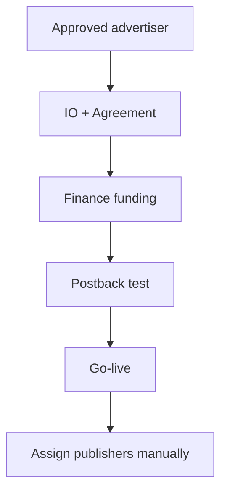

# Advertiser Sales Lead — internal workflow

**Accountable for:** advertiser commercial, IO, postback test (with Ops).

## Daily (30–45 min)

1. Pipeline: apps → DD → approved.  
2. Live offers: cap burn, conversion quality, top-up reminders to Finance.  
3. IO changes — never verbal; amend IO.

## New advertiser

| # | Action | Doc |
|---|--------|-----|
| 1 | Product/LP fit during DD | [advertiser-checklist](../../due-diligence/advertiser-checklist.md) D |
| 2 | `am_signed_off` when commercial OK | |
| 3 | IO + agreement | [client/07](../../due-diligence/onboarding/advertiser/client/07-agreement-and-commercial-pack.md) |
| 4 | Chase Finance for prepay | [client/08 funding](../../due-diligence/onboarding/advertiser/client/08-funding-and-prepay-instructions.md) |
| 5 | Postback test with Ops | [compliance/09 go-live](../../due-diligence/onboarding/advertiser/compliance/09-go-live-sign-off.md) |
| 6 | Invite publishers **one by one** | No open offer |

## Existing advertiser — new offer

1. Licence still valid (Compliance).  
2. IO + prepay slice (Finance).  
3. [14-offer-launch-checklist](../14-offer-launch-checklist.md).

## Escalate

- Credit request → Finance + Compliance + MD if > limit.  
- Dispute / chargeback → [19-chargebacks](../19-chargebacks-and-clawbacks.md).

**Playbook:** [roles/advertiser-lead.md](../roles/advertiser-lead.md)
