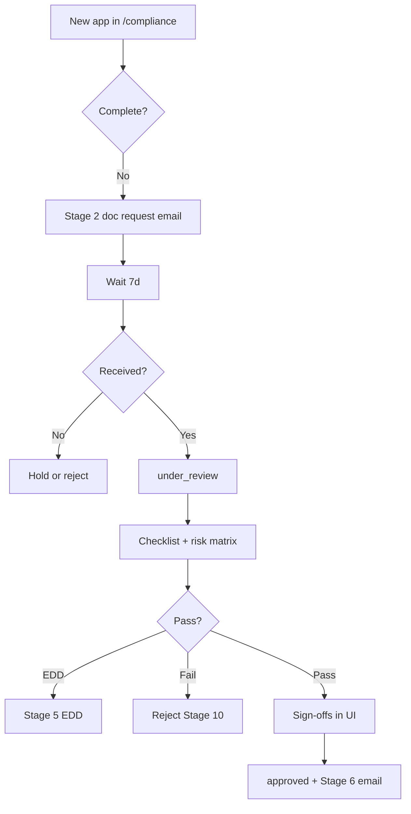

# Compliance — internal workflow

**Accountable for:** approve/reject, sanctions, risk score, DD pack.

## Daily (45–60 min)

1. Open `/compliance` → filter `applied`, `documents_requested`.  
2. **Stage 1** ack if not sent ([intake record](../../due-diligence/onboarding/advertiser/compliance/01-intake-record.md)).  
3. **Stage 2** send client doc pack within **2 business days**.  
4. File uploads to `DD-{id}/` — never IDs in Slack.  
5. Complete sanctions batch.  
6. Update audit log on every status change.

## Per application checklist

| Step | Internal doc | Client doc |
|------|--------------|------------|
| Intake | `compliance/01-intake-record` | `client/01-acknowledgement` |
| Request docs | `compliance/02-document-intake` | `client/02-document-pack` |
| Review | `compliance/03-under-review` | `client/03-review` (optional) |
| Hold | `compliance/04-on-hold-log` | `client/04-on-hold` |
| EDD | `compliance/05-enhanced-dd` | `client/05-edd` |
| Approve | `compliance/06-approval-sign-off` | `client/06-welcome` |

Advertiser path: [advertiser/compliance/](../../due-diligence/onboarding/advertiser/compliance/)  
Publisher path: [publisher/compliance/](../../due-diligence/onboarding/publisher/compliance/)

## Handoffs

| To | When |
|----|------|
| Finance | Advertiser pack complete — credit/prepay |
| Publisher / Advertiser Lead | `approved` — IO |
| Finance & Ops | IO + funding gate — Affise |

## Never

- Approve without sign-offs or with sanctions hit uncleared.  
- Send compliance docs from personal email.  
- Skip risk matrix for “friendly” introducers.

**Playbook:** [roles/compliance.md](../roles/compliance.md)
