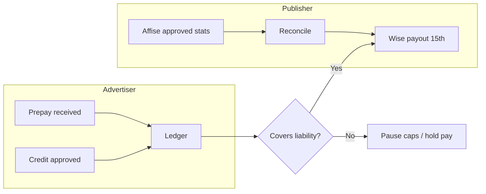

# Finance & Operations — internal workflow

**Accountable for:** money in, money out, Affise config, reconciliations.

## Daily (30 min)

1. Check bank/Wise for inbound prepay — match reference to `DD-A-{id}`.  
2. Update **cash waterfall** sheet.  
3. Flag overdue advertiser invoices (**14d** → tell AM to pause).  
4. Queue payout blocks from Compliance.

## Weekly (before Wed stand-up)

- [ ] Advertiser balance vs caps per live offer.  
- [ ] Invalid % from Affise export.  
- [ ] Clawbacks pending for next 15th.

## Monthly rhythm

| When | Task | Doc |
|------|------|-----|
| 1st–5th | Affise vs ledger reconciliation | [08-publisher-payout-policy](../08-publisher-payout-policy.md) |
| 10th | Payout file draft | Finance playbook |
| **15th** | Execute Wise batch | Remittance email template |
| 20th | Credit advertiser invoices | [09-advertiser-billing](../09-advertiser-billing-policy.md) |
| 25th | Exposure / credit review | [18-credit procedure](../18-advertiser-credit-and-cashflow-procedure.md) |

## Advertiser onboarding (your gates)

| Step | Internal doc |
|------|--------------|
| Credit report + exposure | [08-funding-gate](../../due-diligence/onboarding/advertiser/compliance/08-funding-gate-sign-off.md) |
| Prepay invoice | [client/08-funding](../../due-diligence/onboarding/advertiser/client/08-funding-and-prepay-instructions.md) |
| Affise + go-live | [09-go-live](../../due-diligence/onboarding/advertiser/compliance/09-go-live-sign-off.md) |

## Publisher onboarding

| Step | Internal doc |
|------|--------------|
| Wise verification | [08-payout-verification](../../due-diligence/onboarding/publisher/compliance/08-payout-verification.md) |
| Affise partner | After IO signed |

## Fail-proof

- **Never** pay publishers for unfunded advertiser spend ([18](../18-advertiser-credit-and-cashflow-procedure.md)).  
- **Never** enable caps without Gate 5 sign-off.  
- **Always** attach Affise export to remittance.

**Playbook:** [roles/finance-ops.md](../roles/finance-ops.md)
