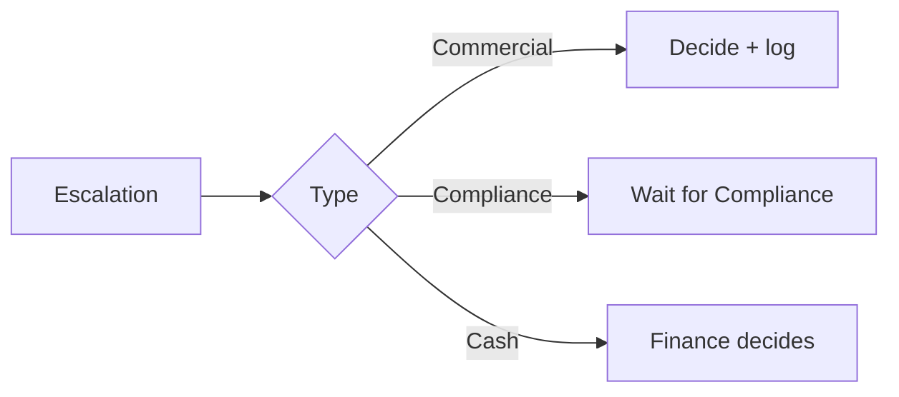

# Managing Director — internal workflow

**Accountable for:** strategy, exceptions, key accounts, escalations.

## Weekly (60 min total)

| Block | Action |
|-------|--------|
| Mon stand-up | Stuck DD, cash risk, live offer issues |
| Pipeline | Apply → approved count; target vs actual |
| Exceptions log | Any gate bypass — must be zero |

## Approvals only you

| Item | Doc |
|------|-----|
| Credit limit > policy max | [18-credit](../18-advertiser-credit-and-cashflow-procedure.md) |
| Rate change > 10% | [01-team RACI](../01-team-and-responsibilities.md) |
| Risk score 60+ exception | Board note / written exception |
| Reinstatement after fraud | Compliance proposal |
| Pay publishers ahead of collection | Written — rare |

## Monthly

- [ ] Readiness items from [15-readiness](../15-readiness-checklist.md)  
- [ ] Solicitor / insurance / DPA dates  
- [ ] One key account call (advertiser + publisher)

## When Compliance is out

- No routine approvals.  
- You may extend **on_hold** deadlines only.

**Playbook:** [roles/md.md](../roles/md.md)
