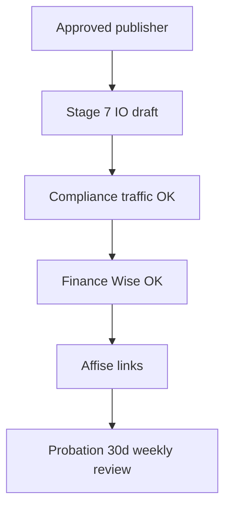

# Publisher Partnerships Lead — internal workflow

**Accountable for:** publisher commercial, IO, traffic quality (with Compliance).

## Daily (30–45 min)

1. Inbox: publisher applications in `under_review` — traffic proof quality.  
2. Active pubs: caps, EPC swings, brand bidding checks.  
3. IO requests from approved pubs — draft within **2 business days**.

## New publisher

| # | Action | Doc |
|---|--------|-----|
| 1 | Support Compliance on traffic proof | [publisher-checklist](../../due-diligence/publisher-checklist.md) D |
| 2 | `am_signed_off` in UI when commercial OK | Stage 6 |
| 3 | Send IO + agreement | [client/07](../../due-diligence/onboarding/publisher/client/07-agreement-and-io-pack.md) |
| 4 | Confirm Wise with Finance | [compliance/08](../../due-diligence/onboarding/publisher/compliance/08-payout-verification.md) |
| 5 | Go-live email | [client/09](../../due-diligence/onboarding/publisher/client/09-go-live-confirmation.md) |

## Probation (first 30 days)

- Weekly: invalid %, source mix, cap usage.  
- >5% invalid without fix in 5 days → pause with Compliance.

## Escalate to Compliance

- Brand bidding violation.  
- New traffic source not on IO.  
- Publisher disputes clawback.

**Playbook:** [roles/publisher-lead.md](../roles/publisher-lead.md)
